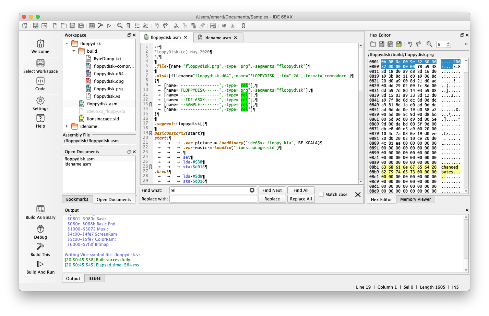

# IDE65XX
IDE 65XX is one of the open source IDE options available for developers working with Kick Assembler.

More info: https://sites.google.com/view/ide65xx

# Features
It is compatible with Windows, MacOS and Linux.

It is developed using C++ and Qt.

It supports an easy-to-navigate tabbed interface that includes a list of open files.

It provides a debugger that supports breakpoint.

It supports a text editor that provides syntax highlighting and code auto-completion.

Undo/Redo

Different cursor for INSERT and OVERWRITE modes in editor

Customize tab size

Find/Replace

Bookmark

Open documents

Hex editor

Memory Viewer

Insert breakpoints

Insert BASIC SYS Line

Insert File and Disk directive

Help for MOS 65XX Opcodes

Includes Kick Assembler Quick Reference

Recent workspace(s) list

Drag and drop files/text

Themes (Fusion, Dark Fusion, Windows, Commodore and Fabric)

Open last used files when starting up

Customisable kits (KickAssembler, JRE, Emulator, Compression Utility, Debugger, c1541, SID Player)

Customisable Kick Assembler Command Line Options

It has an integrated documentation viewer. 

Cartridge conversion utility (create CRT image for cart types and convert to binary file)
